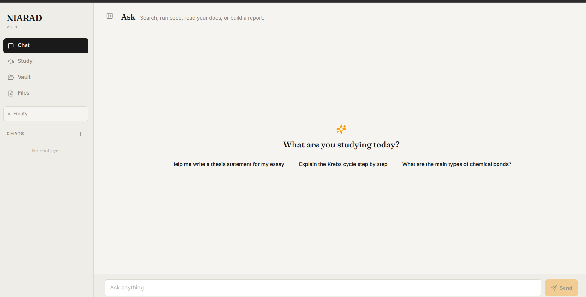
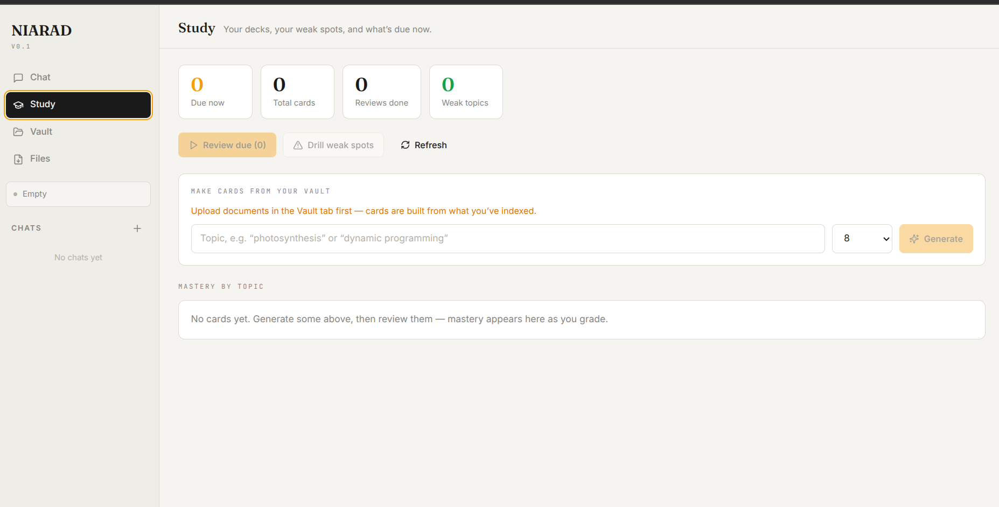

<div align="center">
  
  
  <h1>NIARAD — AI Study Agent </h1>
  
  <p><strong>Offline RAG-powered AI study companion with multi-tool agents and SM-2 spaced repetition.</strong></p>

  [Live Demo](https://niarad-agent.vercel.app/) 
</div>

---

### Overview

**NIARAD** is a full-stack AI study assistant that combines intelligent agents with scientifically proven spaced repetition (SM-2 algorithm).

Ask anything → the agent searches the web, executes code, reads your documents, and generates files. It also tracks what you struggle with and brings weak topics back at the optimal time.

**Production-ready architecture**: Next.js 14 + FastAPI + LangChain.

---

### Key Features

- **Multi-Tool Agent** — Web search, code execution, document Q&A, PDF/DOCX generation
- **Spaced Repetition Engine** — SM-2 algorithm + mastery dashboard + auto flashcard generation
- **Local Document Vault** — Upload PDFs, slides, notes — indexed with FAISS
- **Intelligent Intent Classification** — LLM-powered (no fragile keyword filters)
- **Privacy-First** — Runs locally where possible, free Groq API

---

### Tech Stack

- **Frontend**: Next.js 14 (App Router) + TypeScript + Tailwind + shadcn/ui
- **Backend**: FastAPI + LangChain ReAct + LangGraph
- **AI**: Groq (llama-3.1, mixtral) + HuggingFace embeddings
- **Vector DB**: FAISS (local)
- **Database**: SQLite (study progress)

---

###  Screenshots
<div align='center' >
  



</div>

---

### Quick Start

```bash
# Backend
cd backend && python -m venv venv && source venv/bin/activate
pip install -r requirements.txt
cp .env.example .env
uvicorn main:app --reload

# Frontend
cd frontend && npm install && npm run dev
